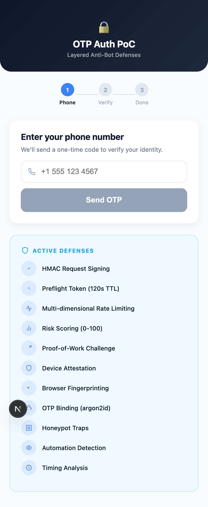
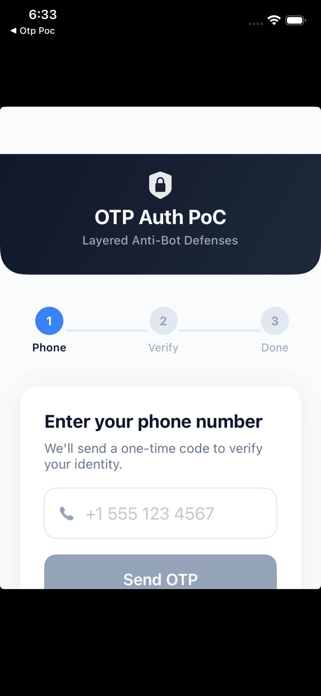
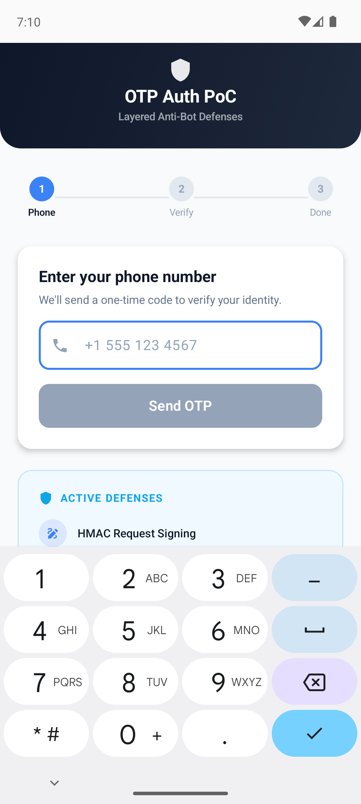
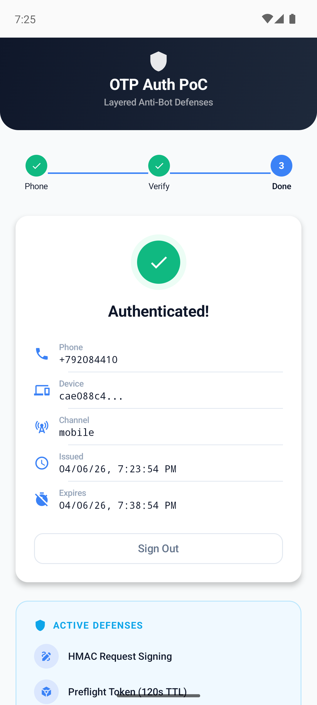
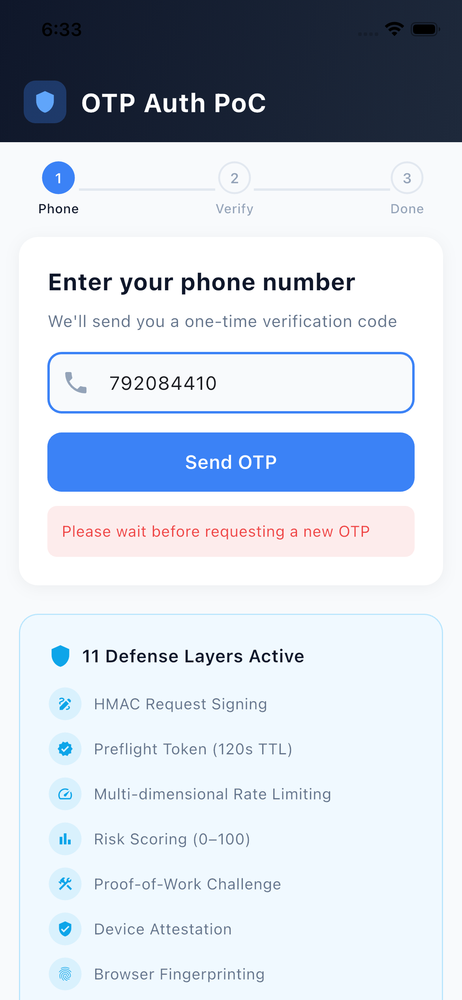
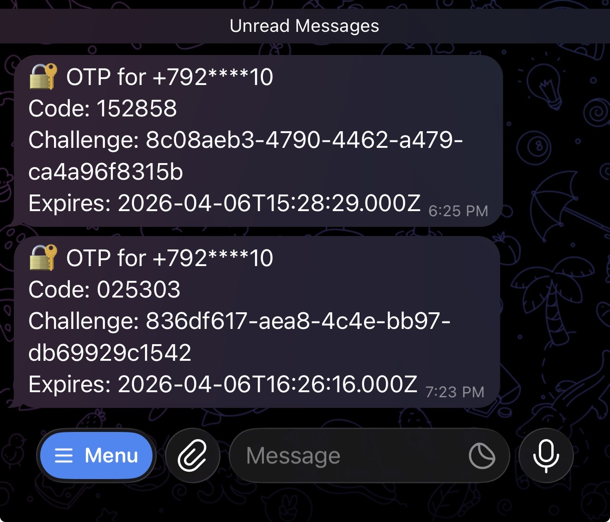

# OTP Authentication PoC — Layered Anti-Bot Defenses


A full-stack Proof-of-Concept implementing **end-to-end OTP authentication** with **11 server-enforced anti-bot defense layers**. Built with a Fastify backend, Next.js web frontend, native iOS (SwiftUI) app, native Android (Kotlin + Jetpack Compose) app, and cross-platform Flutter app — all working against a shared API with HMAC-signed requests, adaptive risk scoring, and proof-of-work challenges.

> Every defense layer is enforced server-side. Client implementations demonstrate how legitimate apps integrate with the security infrastructure.

## Architecture

```
┌──────────────┐  ┌──────────────┐  ┌──────────────┐  ┌──────────────┐  ┌──────────────┐
│  Next.js 15  │  │ iOS SwiftUI  │  │   Android    │  │   Flutter    │  │    Abuse     │
│  Web Client  │  │  Native App  │  │ Kotlin/Comp. │  │  iOS/Android │  │   Scripts    │
│  :3001       │  │  Simulator   │  │  Emulator    │  │              │  │   (tsx)      │
└──────┬───────┘  └──────┬───────┘  └──────┬───────┘  └──────┬───────┘  └──────┬───────┘
       │                 │                 │                  │                 │
       │  HMAC-SHA256    │  HMAC-SHA256    │  HMAC-SHA256     │  HMAC-SHA256    │  HMAC-SHA256
       │  signed reqs    │  signed reqs    │  signed reqs     │  signed reqs    │  signed reqs
       │                 │                 │                  │                 │
       └─────────────────┴─────────────────┴──────────────────┴─────────────────┘
                                           │
                                    ┌──────▼──────┐
                                    │   Fastify 5 │
                                    │   Backend   │
                                    │   :3000     │
                                    └──┬──────┬───┘
                                       │      │
                              ┌────────▼┐  ┌──▼──────────┐
                              │  Redis  │  │ PostgreSQL  │
                              │  7      │  │  16         │
                              │  :6379  │  │  :5432      │
                              └─────────┘  └─────────────┘
```

## Screenshots

### Web (Next.js)

| Phone Input | OTP Verification | Authenticated Session |
|:-----------:|:----------------:|:--------------------:|
|  |  |  |

### iOS (SwiftUI)

| Phone Input | OTP Verification | Authenticated Session |
|:-----------:|:----------------:|:--------------------:|
|  |  |  |

### Android (Kotlin + Jetpack Compose)

| Phone Input | Authenticated Session |
|:-----------:|:--------------------:|
|  |  |

### Flutter (iOS & Android)

| Flutter iOS | Flutter Android |
|:-----------:|:--------------:|
|  |  |

### Telegram OTP Delivery

| OTP via Telegram Bot |
|:-------------------:|
|  |

---

## 11 Defense Layers

All layers are **server-enforced**. The backend computes, validates, and gates every step — clients only supply the required signals.

| # | Layer | How It Works |
|---|-------|-------------|
| 1 | **HMAC Request Signing** | Every API call carries `HMAC-SHA256(method + path + timestamp + bodyHash)` with a shared key. Server verifies signature, rejects clock drift >±30s, deduplicates nonces via Redis (60s TTL). |
| 2 | **Preflight Token (120s TTL)** | `POST /v1/auth/preflight` returns a signed JWT (one-time use, bound to IP + device_id + channel). `POST /v1/auth/otp/send` rejects requests without a valid, unexpired preflight token. |
| 3 | **Multi-dimensional Rate Limiting** | Redis sliding window (atomic Lua script) limits per: phone, IP, /24 subnet, device_id, and browser fingerprint. Returns `429` with `Retry-After` header. Configurable windows and thresholds per endpoint. |
| 4 | **Risk Scoring (0–100)** | 10-factor algorithm: request velocity, datacenter IP detection, abnormal headers, failed PoW/CAPTCHA/attestation, device-phone mismatch, honeypot triggers, automation signals, timing anomalies. **≤30**: pass. **31–60**: require PoW + CAPTCHA. **>60**: block. |
| 5 | **Proof-of-Work Challenge** | Server issues SHA256 challenge (nonce + difficulty). Client must find a counter where `SHA256(nonce + counter)` has N leading zero bits. Web: SubtleCrypto with UI yielding. iOS: CryptoKit on background thread. Flutter: Isolate.run(). |
| 6 | **CAPTCHA Verification** | `POST /v1/challenge/captcha/verify` — stub accepts token `"pass"` only. Required when risk > 30. Production: swap with Cloudflare Turnstile or reCAPTCHA v3. |
| 7 | **Device Attestation** | P256 ECDSA challenge-response. Server issues random challenge; client signs with device-generated private key, returns SPKI public key. Server verifies signature and issues `attestation_jwt` (24h TTL). Required for mobile channel. |
| 8 | **Browser Fingerprinting** | Collects: userAgent, acceptLanguage, timezone, screen resolution, persistent cookie ID. SHA256-hashed and sent as `X-Fingerprint` header. Used in rate limiting keys and risk scoring. |
| 9 | **OTP Binding (argon2id)** | OTP bound to: phone, purpose, challenge_id, device_id. Hashed at rest with argon2id. Max 5 verify attempts (then exhausted), 60s resend cooldown, 5 sends/hour/phone. |
| 10 | **Honeypot Traps** | Web: 3 hidden form fields (name, email, url) invisible to humans (`left: -9999px`, `tabIndex: -1`), scored 25 points if filled. Mobile: jailbreak/debugger detection serves as honeypot equivalent. |
| 11 | **Automation Detection** | Web: `navigator.webdriver`, headless Chrome UA, Selenium/Puppeteer/Playwright globals, missing plugins/languages. iOS: 15 jailbreak paths, sandbox write test, `P_TRACED` debugger detection, suspicious dylibs (Frida/Substrate). Android (native + Flutter): 14 root paths, `ro.build.tags` test-keys, Frida port 27042, `/proc/self/maps` scanning for frida/xposed/substrate/magisk. Capped at 20 risk points. |
| 12 | **Timing Analysis** | Measures page-load-to-submit and first-interaction-to-submit durations. <500ms = certain bot (10pts), <1.5s = likely bot (7pts), <3s = mild (4pts). Instant field fill <100ms = 8pts. |

---

## Tech Stack

| Component | Technology | Version | Key Libraries |
|-----------|-----------|---------|---------------|
| **Backend** | Fastify + TypeScript | 5.1 / 5.6 | argon2, ioredis, pg, jsonwebtoken, zod |
| **Database** | PostgreSQL | 16 | 4 tables: otp_requests, sessions, devices, audit_log |
| **Cache** | Redis | 7 | Rate limiting, nonce dedup, token revocation, PoW challenges |
| **Web** | Next.js + React | 15 / 19 | Zero external deps — Web Crypto API only |
| **iOS** | SwiftUI + Swift | 5.10 | Zero external deps — CryptoKit, Security |
| **Android** | Kotlin + Jetpack Compose | 1.9 / AGP 8.3 | OkHttp, Gson, security-crypto (EncryptedSharedPreferences) |
| **Flutter** | Dart + Flutter SDK | 3.6+ | http, crypto, pointycastle, asn1lib, provider, flutter_secure_storage |
| **Infra** | Docker Compose | — | PostgreSQL 16, Redis 7, multi-service orchestration |

---

## Telegram Bot Setup (OTP Delivery)

This PoC delivers OTP codes via a Telegram bot. In `DEV_MODE=true` (default), OTP codes are also logged to the backend console — so Telegram is **optional for local development**.

### 1. Create a Telegram Bot

1. Open Telegram and search for **@BotFather**
2. Send `/newbot` and follow the prompts to name your bot
3. BotFather will reply with a **bot token** like `123456789:ABCdefGhIjKlMnOpQrStUvWxYz`
4. Save this token — you'll need it in step 3

### 2. Get Your Chat ID

1. Start a conversation with your new bot (send it any message)
2. Open this URL in your browser (replace `YOUR_BOT_TOKEN`):
   ```
   https://api.telegram.org/botYOUR_BOT_TOKEN/getUpdates
   ```
3. Find `"chat":{"id":123456789}` in the JSON response — that number is your **chat ID**

### 3. Configure Credentials

Create a `.env.local` file in the project root (this file is gitignored and will never be committed):

```bash
# .env.local — personal credentials (gitignored)
TELEGRAM_BOT_TOKEN=your_bot_token_from_step_1
TELEGRAM_CHAT_ID=your_chat_id_from_step_2
```

If running the backend directly (not via Docker), also create `backend/.env.local` with the same values.

The `.env.local` file overrides values from `.env` — both Docker Compose and the backend's dotenv loader pick it up automatically.

> **Note:** Never commit real Telegram credentials. The `.env.local` pattern keeps secrets out of version control while `.env.example` documents which variables are needed.

### 4. Verify OTP Delivery

```bash
make up  # or: cd backend && npm run dev
# Trigger an OTP send from any client
# Check your Telegram chat for the 6-digit code
# In DEV_MODE, the code also appears in backend logs: make logs
```

---

## Quick Start

### Prerequisites

- **Docker Desktop** (`brew install --cask docker`)
- **Node.js 22+** (for abuse scripts and local dev)
- **Xcode 16+** with iOS Simulator (for iOS app)
- **Android Studio** with an emulator AVD (for Android app)
- **Flutter SDK 3.6+** (for Flutter app)

### 1. Start the Full Stack (Docker)

```bash
git clone https://github.com/YOUR_USERNAME/otppoc.git
cd otppoc
cp .env.example .env
# Optional: create .env.local with Telegram credentials (see "Telegram Bot Setup" above)
# DEV_MODE=true logs OTP codes to the backend console even without Telegram
make up
```

This starts: PostgreSQL (:5432), Redis (:6379), Backend (:3000), Web (:3001)

### 2. Verify Health

```bash
curl http://localhost:3000/health
# {"status":"ok","timestamp":"..."}
```

### 3. Open Web UI

Open [http://localhost:3001](http://localhost:3001) in your browser. Enter a phone number, follow the OTP flow, and check the backend logs for the OTP code (`make logs`).

### 4. Run iOS App

```bash
make build-ios
# Or open ios/OTPPoc/OTPPoc.xcodeproj in Xcode → Run on Simulator
```

The iOS simulator connects to `http://localhost:3000` directly.

### 5. Run Android App

```bash
cd android
./gradlew installDebug
# Launch from emulator home screen, or:
adb shell am start -n com.otppoc.android/.MainActivity
```

The Android emulator connects to `http://10.0.2.2:3000` (emulator gateway to host machine).

### 6. Run Flutter App

```bash
cd flutter
flutter pub get
flutter run
```

- **iOS Simulator**: connects to `http://localhost:3000`
- **Android Emulator**: connects to `http://10.0.2.2:3000` (emulator gateway to host)

### 7. Run Abuse Simulations

```bash
cd scripts && npm install

# Individual attack scripts
npx tsx abuse-no-preflight.ts          # Bypasses preflight → 401 Unauthorized
npx tsx abuse-rate-limit.ts            # Floods requests → 429 Too Many Requests
npx tsx abuse-invalid-challenges.ts    # Invalid PoW/CAPTCHA → 400/401

# Legitimate end-to-end flow
npx tsx legitimate-flow.ts             # Full happy path (needs OTP from console)

# Run all abuse tests at once
cd .. && make abuse
```

---

## Local Development (Without Docker)

For faster iteration, run services directly on your machine:

### Backend

```bash
# Install and start PostgreSQL & Redis
brew install postgresql@16 redis
brew services start postgresql@16
brew services start redis

# Create database
createuser -s otppoc
createdb -O otppoc otppoc
psql -U otppoc -d otppoc -c "CREATE EXTENSION IF NOT EXISTS \"uuid-ossp\";"
psql -U otppoc -d otppoc -f backend/src/db/migrations/001_initial.sql

# Start backend
cd backend
cp ../.env.example .env
# Edit .env: set POSTGRES_HOST=localhost, REDIS_HOST=localhost
npm install
npm run dev  # Starts on :3000 with hot reload
```

### Web (Next.js)

```bash
cd web
npm install
npm run dev  # Starts on :3001
```

Open [http://localhost:3001](http://localhost:3001) — the web client connects to the backend at `http://localhost:3000` by default. No additional configuration needed.

### iOS (SwiftUI)

Requires **Xcode 16+** with iOS 17+ Simulator.

```bash
# Option A: Xcode GUI
open ios/OTPPoc/OTPPoc.xcodeproj
# Select a simulator (e.g. iPhone 16) → Run (⌘R)

# Option B: Command line
make build-ios
# Or: xcodebuild -project ios/OTPPoc/OTPPoc.xcodeproj -scheme OTPPoc \
#   -destination 'platform=iOS Simulator,name=iPhone 16' build
```

The iOS simulator connects to `http://localhost:3000` directly (no special config needed).

### Android (Kotlin + Jetpack Compose)

Requires **Android Studio** with an emulator AVD (API 26+).

```bash
# 1. Start an Android emulator
emulator -avd Pixel_6_API_33  # or use Android Studio AVD Manager

# 2. Build and install
cd android
./gradlew assembleDebug       # Build debug APK (~16MB)
./gradlew installDebug        # Install on running emulator

# 3. Launch
adb shell am start -n com.otppoc.android/.MainActivity
```

The Android emulator uses `http://10.0.2.2:3000` to reach the host machine's backend (configured in `ApiClient.kt`).

### Flutter (iOS + Android)

Requires **Flutter SDK 3.6+** (`flutter --version` to verify).

```bash
cd flutter
flutter pub get               # Install dependencies

# List available devices
flutter devices

# Run on a specific target
flutter run -d "iPhone 16"          # iOS Simulator
flutter run -d emulator-5554        # Android Emulator
flutter run -d chrome                # Web (debug only)
```

- **iOS Simulator**: connects to `http://localhost:3000`
- **Android Emulator**: connects to `http://10.0.2.2:3000` (auto-detected in `api_client.dart`)

---

## API Reference

### Authentication Flow

```
Client                                    Server
  │                                          │
  ├──POST /v1/auth/preflight──────────────>  │  Collect signals, compute risk
  │<──── preflight_token + risk_score ──────┤
  │                                          │
  │  [if risk > 30]                          │
  ├──POST /v1/challenge/pow/issue─────────>  │  Get PoW challenge
  │<──── nonce + difficulty ────────────────┤
  │  ... solve PoW ...                       │
  ├──POST /v1/challenge/pow/verify────────>  │  Submit solution
  │<──── pow_verified: true ────────────────┤
  │                                          │
  ├──POST /v1/auth/otp/send──────────────>   │  Send OTP (requires preflight token)
  │<──── challenge_id ──────────────────────┤
  │                                          │
  │  ... user receives OTP ...               │
  │                                          │
  ├──POST /v1/auth/otp/verify────────────>   │  Verify OTP code
  │<──── access_token + refresh_token ──────┤
  │                                          │
  ├──GET /v1/auth/session/me─────────────>   │  Get session info
  │<──── session details ───────────────────┤
```

### Endpoints

| Method | Path | Headers Required | Request Body | Response |
|--------|------|-----------------|-------------|----------|
| `POST` | `/v1/auth/preflight` | HMAC (`X-Signature`, `X-Timestamp`, `X-Nonce`), `X-Device-Id`, `X-Channel` | `{ device_id, channel, fingerprint_hash?, client_signals? }` | `{ token, session_id, risk_score, expires_at, pow_challenge?, requires_pow?, requires_captcha? }` |
| `POST` | `/v1/auth/otp/send` | HMAC, `X-Preflight-Token`, `X-Attestation-Token` (mobile) | `{ phone, purpose, pow_solution?, pow_challenge_id?, captcha_token? }` | `{ challenge_id, expires_at, purpose }` |
| `POST` | `/v1/auth/otp/verify` | HMAC | `{ phone, code, challenge_id, device_id }` | `{ access_token, refresh_token, token_type, expires_in }` |
| `GET` | `/v1/auth/session/me` | HMAC, `Authorization: Bearer <token>` | — | `{ phone, device_id, channel, issued_at, expires_at }` |
| `POST` | `/v1/challenge/pow/issue` | HMAC | `{ device_id }` | `{ nonce, difficulty, challenge_id, expires_at }` |
| `POST` | `/v1/challenge/pow/verify` | HMAC | `{ challenge_id, solution }` | `{ verified: true }` |
| `POST` | `/v1/challenge/captcha/verify` | HMAC | `{ token }` | `{ verified: true }` |
| `POST` | `/v1/device/attest` | HMAC | `{ device_id }` | `{ challenge, challenge_id }` |
| `POST` | `/v1/device/attest/verify` | HMAC | `{ challenge_id, device_id, challenge, signed_response, public_key, app_id }` | `{ attestation_jwt, expires_in, note? }` |

### HMAC Request Signing

Every `/v1/*` request must include:

| Header | Value |
|--------|-------|
| `X-Signature` | `HMAC-SHA256(key, payload)` as 64-char hex |
| `X-Timestamp` | Unix timestamp in seconds |
| `X-Nonce` | Random UUID (replay protection) |

**Payload format:**
```
METHOD\nPATH\nTIMESTAMP\nSHA256(BODY)
```

The body hash is computed over the **raw JSON bytes** with **alphabetically sorted keys**. All clients must sort JSON keys before serialization.

---

## Risk Scoring Details

The backend computes a composite risk score (0–100) from 10 independent factors:

| Factor | Max Points | Trigger |
|--------|-----------|---------|
| Request velocity | 20 | 2 pts per request in 60s window (max 10 requests) |
| Datacenter IP | 25 | IP matches known datacenter CIDR (AWS, GCP, Azure, DO, Cloudflare) |
| Abnormal headers | 15 | Missing Accept-Language (5), short UA (5), no fingerprint (5) |
| Failed PoW | 15 | 5 pts per failed attempt (max 3) |
| Failed CAPTCHA | 10 | 5 pts per failed attempt (max 2) |
| Failed attestation | 10 | 10 pts per failure (max 1) |
| Device-phone mismatch | 5 | 2 pts per additional phone on device |
| Honeypot triggered | 25 | Hidden field filled (web) or jailbreak/debugger detected (mobile) |
| Automation signals | 20 | WebDriver (8), headless (4), Selenium/Puppet/Playwright (4 each), missing plugins/langs (2 each) |
| Timing anomalies | 10 | <500ms submit (10), <1.5s (7), <3s (4), instant fill <100ms (8) |

**Thresholds:** ≤30 → allow | 31–60 → require PoW + CAPTCHA | >60 → block

---

## Database Schema

4 PostgreSQL tables with proper indexing:

**`otp_requests`** — OTP lifecycle tracking
- Columns: id (UUID), phone, purpose, challenge_id, device_id, otp_hash (argon2id), ip_address (INET), channel, risk_score, attempts/max_attempts, status (pending/verified/expired/exhausted), created_at, expires_at, verified_at

**`sessions`** — JWT session management
- Columns: id (UUID), phone, device_id, access_token_jti, refresh_token_jti, ip_address, channel, is_active, created_at, expires_at

**`devices`** — Device registry
- Columns: id (VARCHAR PK), phone, channel, attestation_hash, first_seen_at, last_seen_at, metadata (JSONB)

**`audit_log`** — Security event log
- Columns: id (BIGSERIAL), event_type, phone, device_id, ip_address, risk_score, success, metadata (JSONB), created_at

---

## Environment Variables

Copy `.env.example` to `.env` and configure:

| Variable | Default | Description |
|----------|---------|-------------|
| `DEV_MODE` | `true` | Log OTP codes to console (disable in production) |
| `HMAC_CLIENT_KEY` | — | Shared HMAC signing key (min 32 chars) |
| `JWT_SECRET` | — | Access token signing key (min 32 chars) |
| `PREFLIGHT_SECRET` | — | Preflight JWT signing key (min 32 chars) |
| `REFRESH_TOKEN_SECRET` | — | Refresh token signing key (min 32 chars) |
| `ATTESTATION_SECRET` | — | Attestation JWT signing key (min 32 chars) |
| `TELEGRAM_BOT_TOKEN` | — | Telegram bot token from @BotFather |
| `TELEGRAM_CHAT_ID` | — | Telegram chat ID for OTP delivery |
| `POW_DIFFICULTY` | `4` | PoW leading zero bits (increase for harder challenges) |
| `OTP_TTL_SECONDS` | `180` | OTP expiry (3 minutes) |
| `OTP_MAX_VERIFY_ATTEMPTS` | `5` | Max wrong codes before lockout |
| `OTP_RESEND_COOLDOWN_SECONDS` | `60` | Minimum time between resends |
| `OTP_MAX_SENDS_PER_HOUR` | `5` | Max OTPs per phone per hour |
| `PREFLIGHT_TTL_SECONDS` | `120` | Preflight token lifetime |

---

## Project Structure

```
otppoc/
├── backend/                        # Fastify 5 + TypeScript API server
│   ├── src/
│   │   ├── config/                 # Environment validation (zod), constants
│   │   │   ├── env.ts              # Zod schema for all env vars
│   │   │   └── constants.ts        # Rate limits, risk weights, timing thresholds
│   │   ├── db/
│   │   │   └── migrations/
│   │   │       └── 001_initial.sql # Full database schema
│   │   ├── middleware/
│   │   │   ├── hmac-verify.ts      # HMAC signature verification
│   │   │   ├── rate-limiter.ts     # Lua-based sliding window rate limiter
│   │   │   ├── risk-gate.ts        # Risk score computation + adaptive gates
│   │   │   ├── preflight-guard.ts  # Preflight token validation (IP/device binding)
│   │   │   ├── attestation-guard.ts# Mobile attestation JWT verification
│   │   │   └── request-context.ts  # Extract IP, subnet, device, channel, signals
│   │   ├── routes/
│   │   │   ├── auth.routes.ts      # /v1/auth/* (preflight, otp/send, otp/verify, session/me)
│   │   │   ├── challenge.routes.ts # /v1/challenge/* (pow, captcha)
│   │   │   └── device.routes.ts    # /v1/device/* (attest, attest/verify)
│   │   ├── services/
│   │   │   ├── otp.service.ts      # OTP generation, argon2id hashing, verification
│   │   │   ├── preflight.service.ts# Preflight token issuance and validation
│   │   │   ├── risk.service.ts     # 10-factor risk scoring algorithm
│   │   │   ├── pow.service.ts      # PoW challenge issuance and verification
│   │   │   ├── captcha.service.ts  # CAPTCHA stub (token="pass")
│   │   │   ├── attestation.service.ts # P256 ECDSA attestation
│   │   │   ├── session.service.ts  # JWT session management
│   │   │   ├── hmac.service.ts     # HMAC computation and verification
│   │   │   ├── fingerprint.service.ts # Browser fingerprint hashing
│   │   │   └── telegram.service.ts # OTP delivery via Telegram bot
│   │   └── utils/
│   │       ├── crypto.ts           # Hashing, random generation utilities
│   │       ├── ip.ts               # IP parsing, /24 subnet extraction, datacenter detection
│   │       ├── phone.ts            # E.164 phone normalization
│   │       └── errors.ts           # Custom error classes
│   └── tests/                      # 252+ vitest unit tests across 20 suites
│       ├── middleware/             # Tests for all 6 middleware
│       ├── services/              # Tests for all 9 services
│       ├── utils/                 # Tests for all 4 utilities
│       └── helpers/               # Mock Redis, Mock PG helpers
│
├── web/                            # Next.js 15 + React 19 web client
│   └── src/
│       ├── app/
│       │   ├── page.tsx            # Single-page auth UI (phone → OTP → session)
│       │   ├── layout.tsx          # Root layout with metadata
│       │   └── globals.css         # Keyframe animations (fadeIn, pulse, scaleIn)
│       ├── hooks/
│       │   └── useAuthFlow.ts      # Auth state machine (idle → preflight → pow → otp → verified)
│       └── lib/
│           ├── api-client.ts       # Fetch wrapper with HMAC signing + fingerprint
│           ├── hmac.ts             # HMAC-SHA256 via Web Crypto API
│           ├── fingerprint.ts      # Browser fingerprint collection + hashing
│           ├── pow-solver.ts       # SHA256 PoW solver (yields every 10k iterations)
│           ├── automation-detect.ts# WebDriver/headless/Selenium/Puppeteer/Playwright detection
│           └── storage.ts          # localStorage utilities (device ID, tokens)
│
├── ios/OTPPoc/                     # Native SwiftUI iOS app (iOS 17+, Swift 5.10)
│   └── OTPPoc/
│       ├── OTPPocApp.swift         # App entry point
│       ├── Models/
│       │   ├── AuthModels.swift    # Request/response DTOs
│       │   └── DeviceModels.swift  # Attestation models
│       ├── Networking/
│       │   ├── APIClient.swift     # URLSession-based HTTP client with HMAC
│       │   ├── HMACSigner.swift    # CryptoKit HMAC-SHA256
│       │   └── TokenManager.swift  # Keychain token storage
│       ├── Services/
│       │   ├── AttestationService.swift  # CryptoKit P256 ECDSA attestation
│       │   ├── IntegrityService.swift    # Jailbreak + debugger detection
│       │   └── PoWService.swift          # CryptoKit SHA256 PoW solver
│       ├── ViewModels/
│       │   └── AuthViewModel.swift       # @Published state machine (7 states)
│       ├── Views/
│       │   ├── ContentView.swift         # Main container with AnimatedSwitcher
│       │   ├── PhoneInputView.swift      # Phone number entry
│       │   ├── OTPVerifyView.swift       # 6-digit code input
│       │   ├── SessionView.swift         # Authenticated session display
│       │   ├── Theme.swift               # Color palette + typography
│       │   └── Components/
│       │       ├── DefenseCard.swift      # 11 defense layers display
│       │       └── StepIndicator.swift    # 3-step progress indicator
│       └── Utilities/
│           ├── KeychainHelper.swift       # Security framework wrapper
│           └── PhoneFormatter.swift       # E.164 validation
│
├── android/                        # Native Kotlin + Jetpack Compose Android app
│   ├── build.gradle.kts            # Root build: AGP 8.3, Kotlin 1.9
│   ├── settings.gradle.kts         # Module configuration
│   └── app/
│       ├── build.gradle.kts        # compileSdk 34, Compose BOM 2024.02, dependencies
│       └── src/main/
│           ├── AndroidManifest.xml  # INTERNET permission, cleartext config
│           ├── res/
│           │   ├── xml/network_security_config.xml  # 10.0.2.2 + localhost cleartext
│           │   └── values/          # strings.xml, themes.xml
│           └── java/com/otppoc/android/
│               ├── MainActivity.kt              # Compose entry point
│               ├── models/
│               │   ├── AuthModels.kt            # Request/response DTOs
│               │   └── DeviceModels.kt          # Attestation models
│               ├── networking/
│               │   ├── ApiClient.kt             # OkHttp + Gson with sorted-key JSON
│               │   ├── HmacSigner.kt            # javax.crypto HMAC-SHA256
│               │   └── TokenManager.kt          # EncryptedSharedPreferences storage
│               ├── services/
│               │   ├── AttestationService.kt    # Java EC P256 ECDSA attestation
│               │   ├── IntegrityService.kt      # Root + Frida + debugger detection
│               │   └── PowService.kt            # Coroutine-based PoW solver
│               ├── ui/theme/
│               │   └── Theme.kt                 # Color palette + spacing constants
│               ├── utilities/
│               │   └── PhoneFormatter.kt        # E.164 validation
│               ├── viewmodels/
│               │   └── AuthViewModel.kt         # StateFlow state machine (8 states)
│               └── views/
│                   ├── ContentView.kt           # Main container with AnimatedContent
│                   ├── PhoneInputView.kt        # Phone number entry
│                   ├── LoadingView.kt           # Animated 3-dot loader
│                   ├── OtpVerifyView.kt         # 6-digit monospace input
│                   ├── SessionView.kt           # Session display with animated checkmark
│                   └── components/
│                       ├── DefenseCard.kt       # 11 defense layers display
│                       └── StepIndicator.kt     # 3-step progress indicator
│
├── flutter/                        # Cross-platform Flutter app (iOS + Android)
│   ├── pubspec.yaml                # Dependencies manifest
│   ├── lib/
│   │   ├── main.dart               # App entry point with Provider
│   │   ├── models/
│   │   │   ├── auth_models.dart    # Request/response DTOs
│   │   │   └── device_models.dart  # Attestation models
│   │   ├── networking/
│   │   │   ├── api_client.dart     # HTTP client with HMAC + sorted-key JSON
│   │   │   ├── hmac_signer.dart    # crypto package HMAC-SHA256
│   │   │   └── token_manager.dart  # flutter_secure_storage wrapper
│   │   ├── services/
│   │   │   ├── attestation_service.dart  # PointyCastle P256 + asn1lib DER
│   │   │   ├── integrity_service.dart    # iOS jailbreak + Android root detection
│   │   │   └── pow_service.dart          # Isolate-based PoW solver
│   │   ├── view_models/
│   │   │   └── auth_view_model.dart      # ChangeNotifier state machine (8 states)
│   │   ├── views/
│   │   │   ├── content_view.dart         # Main container with AnimatedSwitcher
│   │   │   ├── phone_input_view.dart     # Phone number entry
│   │   │   ├── loading_view.dart         # Animated 3-dot loader
│   │   │   ├── otp_verify_view.dart      # 6-digit monospace input
│   │   │   ├── session_view.dart         # Session display with animated checkmark
│   │   │   ├── theme.dart                # Material color scheme
│   │   │   └── components/
│   │   │       ├── defense_card.dart     # 11 defense layers display
│   │   │       └── step_indicator.dart   # 3-step progress indicator
│   │   └── utilities/
│   │       └── phone_formatter.dart      # E.164 validation
│   └── test/                       # 60 unit + widget tests across 7 files
│       ├── widget_test.dart        # ContentView, StepIndicator, DefenseCard, AuthViewModel
│       ├── auth_models_test.dart   # Model serialization (19 tests)
│       ├── device_models_test.dart # Attestation models (3 tests)
│       ├── hmac_signer_test.dart   # HMAC signature validation (5 tests)
│       ├── phone_formatter_test.dart # E.164 formatting (10 tests)
│       ├── pow_service_test.dart   # PoW solver correctness (5 tests)
│       └── api_client_test.dart    # Sorted-key JSON encoding (6 tests)
│
├── scripts/                        # Abuse simulation scripts
│   ├── abuse-no-preflight.ts       # Tests preflight requirement → 401
│   ├── abuse-rate-limit.ts         # Tests rate limiting → 429
│   ├── abuse-invalid-challenges.ts # Tests invalid PoW/CAPTCHA → 400/401
│   ├── legitimate-flow.ts          # Full happy path end-to-end
│   └── helpers.ts                  # Shared HMAC signing + HTTP utilities
│
├── infra/                          # Docker infrastructure
│   ├── postgres/init.sql           # PostgreSQL extensions (uuid-ossp)
│   └── redis/redis.conf            # Redis configuration
│
├── docs/
│   └── DEFENSE_LAYERS_PRODUCT_SPEC.md  # Product owner defense specification
│
├── docker-compose.yml              # 4-service orchestration
├── Makefile                        # Build, run, test, abuse commands
├── STATE_MACHINE.md                # Client/server state machine documentation
├── CLAUDE.md                       # AI assistant project context
└── .env.example                    # Environment variable template
```

---

## Testing

### Backend (252+ tests)

```bash
cd backend && npm test
```

20 test suites covering:
- **Middleware**: HMAC verification, rate limiting (Lua script), preflight guard, risk gate, attestation guard, request context
- **Services**: OTP (argon2id hashing, verification, exhaustion), PoW (challenge/verify), risk scoring (all 10 factors), preflight (JWT issuance/validation), session (JWT management), attestation (P256 ECDSA), CAPTCHA, HMAC, fingerprint
- **Utilities**: crypto helpers, IP parsing/subnet extraction/datacenter detection, phone normalization, error classes
- **Config**: constants validation

### Flutter (60 tests)

```bash
cd flutter && flutter test
```

7 test files covering:
- Model serialization/deserialization (19 tests)
- HMAC signature generation and validation (5 tests)
- PoW solver correctness across difficulties (5 tests)
- Phone number E.164 formatting (10 tests)
- Widget rendering and interaction (12 tests)
- Sorted-key JSON encoding for HMAC (6 tests)
- Device/attestation model serialization (3 tests)

### Abuse Simulations

```bash
make abuse  # Runs all 3 attack scripts
```

| Script | Attack | Expected Result |
|--------|--------|----------------|
| `abuse-no-preflight.ts` | Sends OTP without preflight token | `401 Unauthorized` |
| `abuse-rate-limit.ts` | Floods preflight requests | `429 Too Many Requests` by request 6 |
| `abuse-invalid-challenges.ts` | Submits invalid PoW/CAPTCHA | `400 Bad Request` / `401` |

---

## Threat Model

### Threats Mitigated

| Threat | Mitigation |
|--------|-----------|
| **OTP Bombing** | Rate limiting (5/hour/phone) + 60s resend cooldown + preflight requirement |
| **Credential Stuffing** | Max 5 verify attempts per OTP, then exhaustion lockout |
| **Bot Automation** | HMAC signing + preflight tokens + PoW + CAPTCHA + attestation |
| **API Scraping** | HMAC request signing prevents raw `curl` abuse |
| **Replay Attacks** | Nonce dedup (60s Redis TTL) + preflight JTI one-time use |
| **IP Rotation** | /24 subnet rate limiting + device_id tracking + fingerprint correlation |
| **SIM Swap/Hijack** | OTP bound to device_id (partial mitigation) |
| **Datacenter Traffic** | Risk scoring penalizes known cloud provider IP ranges |
| **Headless Browsers** | Automation detection (WebDriver, headless UA, framework globals) |
| **Form Bots** | Honeypot traps + timing analysis |

### PoC Limitations (Production Considerations)

| Limitation | Production Fix |
|-----------|---------------|
| HMAC key embedded in client code | Key rotation via attestation-bound key exchange |
| Attestation uses PoC keypair (not hardware-backed) | iOS: [App Attest](https://developer.apple.com/documentation/devicecheck), Android: [Play Integrity](https://developer.android.com/google/play/integrity) |
| CAPTCHA stub (token="pass") | [Cloudflare Turnstile](https://developers.cloudflare.com/turnstile/) or reCAPTCHA v3 |
| OTP via Telegram bot | Twilio, Vonage, or AWS SNS |
| No TLS in local setup | HTTPS mandatory in production |
| Basic browser fingerprint | [FingerprintJS Pro](https://fingerprint.com/) |
| Datacenter IP list is hardcoded | MaxMind GeoIP2 or ip-api.com |

---

## State Machine

See [`STATE_MACHINE.md`](STATE_MACHINE.md) for the full client/server state machine documentation, including all states, transitions, guards, Redis key lifecycle, and defense layer integration points.

---

## License

This project is a Proof-of-Concept for educational and demonstration purposes.
